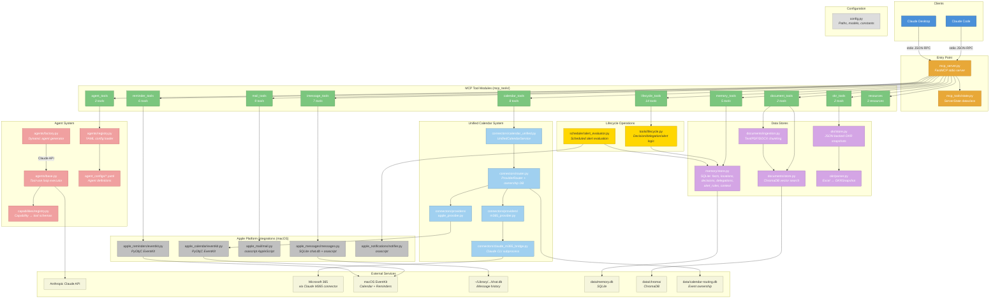

# Architecture Diagram

```mermaid
graph TB
    subgraph Clients["Clients"]
        CC["Claude Code"]
        CD["Claude Desktop"]
    end

    subgraph EntryPoint["Entry Point"]
        MCP["mcp_server.py<br/><i>FastMCP stdio server</i>"]
        STATE["mcp_tools/state.py<br/><i>ServerState dataclass</i>"]
    end

    MCP --> STATE

    subgraph ToolModules["MCP Tool Modules (mcp_tools/)"]
        MT["memory_tools<br/><i>5 tools</i>"]
        DT["document_tools<br/><i>2 tools</i>"]
        AT["agent_tools<br/><i>3 tools</i>"]
        LT["lifecycle_tools<br/><i>14 tools</i>"]
        CT["calendar_tools<br/><i>8 tools</i>"]
        RT["reminder_tools<br/><i>6 tools</i>"]
        MLT["mail_tools<br/><i>9 tools</i>"]
        IT["imessage_tools<br/><i>7 tools</i>"]
        OT["okr_tools<br/><i>2 tools</i>"]
        RES["resources<br/><i>3 resources</i>"]
    end

    CC -->|stdio JSON-RPC| MCP
    CD -->|stdio JSON-RPC| MCP

    MCP --> MT
    MCP --> DT
    MCP --> AT
    MCP --> LT
    MCP --> CT
    MCP --> RT
    MCP --> MLT
    MCP --> IT
    MCP --> OT
    MCP --> RES

    subgraph DataStores["Data Stores"]
        MS["memory/store.py<br/><i>SQLite: facts, locations,<br/>decisions, delegations,<br/>alert_rules, context</i>"]
        DS["documents/store.py<br/><i>ChromaDB vector search</i>"]
        DI["documents/ingestion.py<br/><i>Text/PDF/DOCX chunking</i>"]
        OKRS["okr/store.py<br/><i>JSON-backed OKR snapshots</i>"]
        OKRP["okr/parser.py<br/><i>Excel → OKRSnapshot</i>"]
    end

    subgraph AgentSystem["Agent System"]
        AR["agents/registry.py<br/><i>YAML config loader</i>"]
        AB["agents/base.py<br/><i>Tool-use loop executor</i>"]
        AF["agents/factory.py<br/><i>Dynamic agent generator</i>"]
        CR["capabilities/registry.py<br/><i>Capability → tool schemas</i>"]
        YAML["agent_configs/*.yaml<br/><i>Agent definitions</i>"]
    end

    subgraph UnifiedCalendar["Unified Calendar System"]
        UCS["connectors/calendar_unified.py<br/><i>UnifiedCalendarService</i>"]
        PR["connectors/router.py<br/><i>ProviderRouter + ownership DB</i>"]
        AP["connectors/providers/<br/>apple_provider.py"]
        MP["connectors/providers/<br/>m365_provider.py"]
        MB["connectors/claude_m365_bridge.py<br/><i>Claude CLI subprocess</i>"]
    end

    subgraph ApplePlatform["Apple Platform Integrations (macOS)"]
        AC["apple_calendar/eventkit.py<br/><i>PyObjC EventKit</i>"]
        ARM["apple_reminders/eventkit.py<br/><i>PyObjC EventKit</i>"]
        AM["apple_mail/mail.py<br/><i>osascript AppleScript</i>"]
        AIM["apple_messages/messages.py<br/><i>SQLite chat.db + osascript</i>"]
        AN["apple_notifications/notifier.py<br/><i>osascript</i>"]
    end

    subgraph Lifecycle["Lifecycle Operations"]
        TL["tools/lifecycle.py<br/><i>Decision/delegation/alert logic</i>"]
        AE["scheduler/alert_evaluator.py<br/><i>Scheduled alert evaluation</i>"]
    end

    subgraph Config["Configuration"]
        CFG["config.py<br/><i>Paths, models, constants</i>"]
    end

    %% Tool module → Store connections
    MT --> MS
    DT --> DS
    DT --> DI
    AT --> AR
    LT --> TL
    CT --> UCS
    RT --> ARM
    MLT --> AM
    IT --> AIM
    OT --> OKRS

    %% Calendar routing
    UCS --> PR
    PR --> AP
    PR --> MP
    AP --> AC
    MP --> MB

    %% Agent system
    AR --> YAML
    AB --> CR
    AF -->|Claude API| AB

    %% Lifecycle
    TL --> MS
    AE --> MS
    AE --> AN

    %% OKR
    OKRS --> OKRP

    %% Data layer
    DI --> DS

    subgraph ExternalServices["External Services"]
        CLAUDE_API["Anthropic Claude API"]
        M365["Microsoft 365<br/><i>via Claude M365 connector</i>"]
        EVENTKIT["macOS EventKit<br/><i>Calendar + Reminders</i>"]
        CHATDB["~/Library/.../chat.db<br/><i>iMessage history</i>"]
        SQDB["data/memory.db<br/><i>SQLite</i>"]
        CRDB["data/chroma/<br/><i>ChromaDB</i>"]
        RTDB["data/calendar-routing.db<br/><i>Event ownership</i>"]
    end

    AB --> CLAUDE_API
    MB --> M365
    AC --> EVENTKIT
    ARM --> EVENTKIT
    AIM --> CHATDB
    MS --> SQDB
    DS --> CRDB
    PR --> RTDB

    %% Styling
    classDef client fill:#4A90D9,stroke:#2C5F8A,color:#fff
    classDef entry fill:#E8A838,stroke:#B07D28,color:#fff
    classDef tools fill:#7BC67E,stroke:#4A8A4C,color:#fff
    classDef stores fill:#D4A5E5,stroke:#9B6DB0,color:#fff
    classDef agents fill:#F0A0A0,stroke:#C06060,color:#fff
    classDef calendar fill:#A0D0F0,stroke:#6090B0,color:#fff
    classDef apple fill:#C0C0C0,stroke:#808080,color:#333
    classDef external fill:#F5F5DC,stroke:#A0A080,color:#333
    classDef lifecycle fill:#FFD700,stroke:#B8960F,color:#333
    classDef config fill:#DDD,stroke:#999,color:#333

    class CC,CD client
    class MCP,STATE entry
    class MT,DT,AT,LT,CT,RT,MLT,IT,OT,RES tools
    class MS,DS,DI,OKRS,OKRP stores
    class AR,AB,AF,CR,YAML agents
    class UCS,PR,AP,MP,MB calendar
    class AC,ARM,AM,AIM,AN apple
    class CLAUDE_API,M365,EVENTKIT,CHATDB,SQDB,CRDB,RTDB external
    class TL,AE lifecycle
    class CFG config
```
