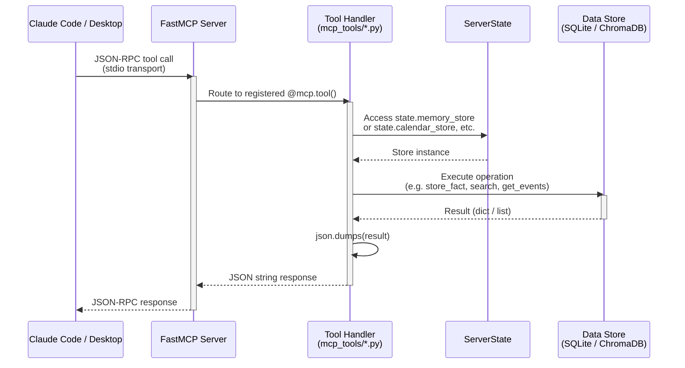
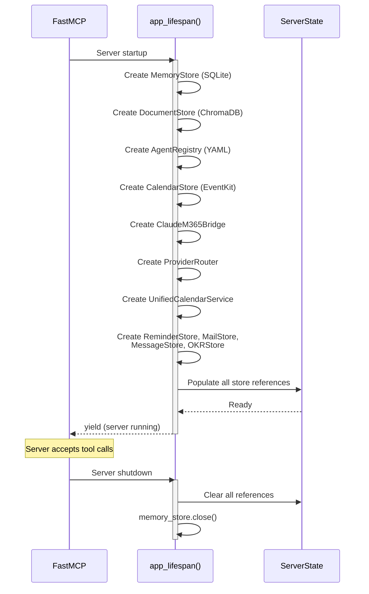
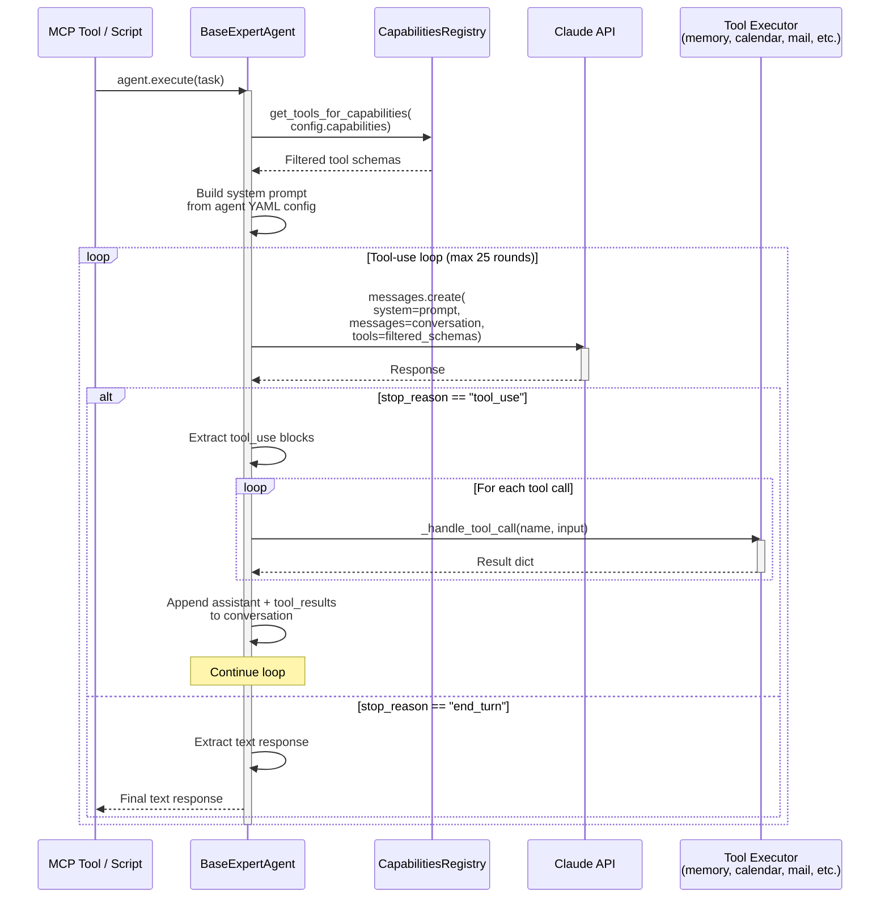

# Architecture

This document provides visual architecture diagrams for the Chief of Staff (Jarvis) system using Mermaid.

---

## 1. System Architecture

High-level component map showing all modules, data stores, platform integrations, and their interconnections. Arrows indicate data flow direction.

```mermaid
graph TB
    %% ── Clients ──────────────────────────────────────────────────
    subgraph Clients["Clients"]
        CC["Claude Code"]
        CD["Claude Desktop"]
        IM["iMessage<br/>(inbox-monitor.sh)"]
    end

    %% ── MCP Server ──────────────────────────────────────────────
    subgraph MCP["MCP Server"]
        direction TB
        EP["mcp_server.py<br/><i>FastMCP entry point</i>"]
        SS["ServerState<br/><i>mcp_tools/state.py</i>"]
        EP -->|populates| SS
    end

    %% ── Tool Modules ────────────────────────────────────────────
    subgraph Tools["Tool Modules  (56 tools + 3 resources)"]
        direction TB
        TM["memory_tools<br/><i>5 tools</i>"]
        TD["document_tools<br/><i>2 tools</i>"]
        TA["agent_tools<br/><i>3 tools</i>"]
        TL["lifecycle_tools<br/><i>14 tools</i>"]
        TC["calendar_tools<br/><i>8 tools</i>"]
        TR["reminder_tools<br/><i>6 tools</i>"]
        TMA["mail_tools<br/><i>9 tools</i>"]
        TI["imessage_tools<br/><i>7 tools</i>"]
        TO["okr_tools<br/><i>2 tools</i>"]
        TRES["resources<br/><i>3 resources</i>"]
    end

    %% ── Data Stores ─────────────────────────────────────────────
    subgraph DataStores["Data Stores"]
        MS["MemoryStore<br/><i>SQLite (memory.db)</i><br/>facts, locations, context,<br/>decisions, delegations, alerts"]
        DS["DocumentStore<br/><i>ChromaDB (data/chroma/)</i><br/>all-MiniLM-L6-v2 embeddings"]
        OS["OKRStore<br/><i>JSON (data/okr/)</i><br/>Excel-parsed snapshots"]
        RDB["OwnershipDB<br/><i>SQLite (calendar-routing.db)</i><br/>event provider tracking"]
    end

    %% ── Agent System ────────────────────────────────────────────
    subgraph AgentSystem["Agent System"]
        direction TB
        AR["AgentRegistry<br/><i>YAML configs in agent_configs/</i>"]
        BE["BaseExpertAgent<br/><i>Tool-use loop with Claude API</i>"]
        AF["AgentFactory<br/><i>Claude-generated configs</i>"]
        CR["CapabilitiesRegistry<br/><i>22 capabilities, tool gating</i>"]
        AR --> BE
        AF --> AR
        CR --> BE
    end

    %% ── Unified Calendar ────────────────────────────────────────
    subgraph Calendar["Unified Calendar"]
        direction TB
        UCS["UnifiedCalendarService<br/><i>Facade + dedup + ownership</i>"]
        PR["ProviderRouter<br/><i>Read/write routing policy</i>"]
        AP["AppleCalendarProvider"]
        MP["Microsoft365CalendarProvider"]
        UCS --> PR
        PR --> AP
        PR --> MP
    end

    %% ── Apple Platform ──────────────────────────────────────────
    subgraph Apple["Apple Platform Integrations"]
        direction TB
        ACS["CalendarStore<br/><i>PyObjC EventKit</i>"]
        ARS["ReminderStore<br/><i>PyObjC EventKit</i>"]
        AMS["MailStore<br/><i>osascript / AppleScript</i>"]
        MSGS["MessageStore<br/><i>SQLite chat.db + osascript</i><br/><i>guid resolution for group chats</i>"]
        NOT["Notifier<br/><i>osascript</i>"]
    end

    %% ── Lifecycle ───────────────────────────────────────────────
    subgraph Lifecycle["Lifecycle Engine"]
        direction TB
        LT["lifecycle.py<br/><i>Decision/delegation/alert ops</i>"]
    end

    %% ── External Services ───────────────────────────────────────
    subgraph External["External Services"]
        CLAUDE_API["Claude API<br/><i>Anthropic Messages API</i>"]
        M365["Microsoft 365<br/><i>via Claude CLI subprocess</i>"]
        EK["EventKit Framework<br/><i>macOS Calendar + Reminders</i>"]
        CHATDB["chat.db<br/><i>macOS iMessage database</i>"]
    end

    %% ── Client connections ──────────────────────────────────────
    CC -->|"stdio JSON-RPC"| EP
    CD -->|"stdio JSON-RPC"| EP
    IM -->|"claude CLI subprocess"| CLAUDE_API

    %% ── Tool module wiring ──────────────────────────────────────
    SS --> TM & TD & TA & TL & TC & TR & TMA & TI & TO & TRES

    %% ── Tool to Store connections ───────────────────────────────
    TM --> MS
    TD --> DS
    TA --> AR
    TL --> LT
    LT --> MS
    TC --> UCS
    TR --> ARS
    TMA --> AMS & NOT
    TI --> MSGS
    TO --> OS

    %% ── Calendar provider to backend ────────────────────────────
    AP --> ACS
    ACS --> EK
    MP -->|"ClaudeM365Bridge"| M365

    %% ── Unified calendar to ownership DB ────────────────────────
    UCS --> RDB

    %% ── Agent system to external ────────────────────────────────
    BE --> CLAUDE_API

    %% ── Message store to backend ────────────────────────────────
    MSGS --> CHATDB
    ARS --> EK

    %% ── Styling ─────────────────────────────────────────────────
    classDef client fill:#4a9eff,stroke:#2d6cc0,color:#fff
    classDef server fill:#2d2d2d,stroke:#555,color:#fff
    classDef tool fill:#6c5ce7,stroke:#4834d4,color:#fff
    classDef store fill:#00b894,stroke:#00816a,color:#fff
    classDef agent fill:#e17055,stroke:#b33939,color:#fff
    classDef calendar fill:#fdcb6e,stroke:#d4a017,color:#333
    classDef apple fill:#a29bfe,stroke:#6c5ce7,color:#fff
    classDef lifecycle fill:#fab1a0,stroke:#e17055,color:#333
    classDef external fill:#636e72,stroke:#2d3436,color:#fff

    class CC,CD,IM client
    class EP,SS server
    class TM,TD,TA,TL,TC,TR,TMA,TI,TO,TRES tool
    class MS,DS,OS,RDB store
    class AR,BE,AF,CR agent
    class UCS,PR,AP,MP calendar
    class ACS,ARS,AMS,MSGS,NOT apple
    class LT lifecycle
    class CLAUDE_API,M365,EK,CHATDB external
```



---

## 2. Request Flow

How a single MCP tool call flows from client to data store and back.



### Lifespan Initialization

Before any tool call is processed, the `app_lifespan` context manager initializes all stores and populates `ServerState`:



---

## 3. iMessage Inbox Monitor Flow

The `inbox-monitor.sh` script is a cron-driven pipeline that polls iMessage for "jarvis:" commands. It uses three Claude CLI passes for classification, execution, and delivery.

```mermaid
flowchart TD
    START([Cron trigger / manual run]) --> READ_DB

    %% ── Message ingestion ───────────────────────────────────────
    subgraph Ingestion["Message Ingestion"]
        READ_DB["Read iMessage database<br/><i>imessage-reader binary</i>"]
        READ_DB --> FILTER["Filter: only 'jarvis:' prefixed<br/>messages in lookback window"]
        FILTER --> CHECK_GUID{"Already<br/>processed?<br/>(check GUIDs)"}
        CHECK_GUID -->|Yes| SKIP["Skip message"]
        CHECK_GUID -->|No| STRIP["Strip 'jarvis:' prefix<br/>to get instruction"]
    end

    %% ── Approval check ──────────────────────────────────────────
    STRIP --> APPROVAL_CMD{"Starts with<br/>'approve' or<br/>'reject'?"}
    APPROVAL_CMD -->|Yes| HANDLE_APPROVAL["Handle approval/rejection<br/>from pending queue"]
    APPROVAL_CMD -->|No| PASS1

    HANDLE_APPROVAL --> PASS3

    %% ── Pass 1: Classification ──────────────────────────────────
    subgraph Pass1["Pass 1: Classify"]
        PASS1["Invoke Claude CLI with<br/>inbox_triage.yaml prompt<br/>+ JSON schema"]
        PASS1 --> PARSE1["Parse structured output:<br/>category, agent, instruction"]
    end

    %% ── Approval gate ───────────────────────────────────────────
    PARSE1 --> NEEDS_APPROVAL{"Requires hard<br/>approval?<br/>(send, write ops)"}
    NEEDS_APPROVAL -->|Yes| CREATE_PENDING["Create pending approval<br/>Notify user via iMessage<br/>with approval ID"]
    CREATE_PENDING --> SAVE_GUID["Save GUID as processed"]
    NEEDS_APPROVAL -->|No| PASS2

    %% ── Pass 2: Execution ───────────────────────────────────────
    subgraph Pass2["Pass 2: Execute"]
        PASS2{"Named agent<br/>assigned?"}
        PASS2 -->|Yes| AGENT_DISPATCH["Load agent YAML prompt<br/>Invoke Claude CLI with<br/>connector routing policy"]
        PASS2 -->|No| INLINE["Handle inline:<br/>REMEMBER, TODO, NOTE,<br/>SEARCH, LOCATION"]
        AGENT_DISPATCH --> PARSE2
        INLINE --> PARSE2
        PARSE2["Parse execution result:<br/>action_taken, success,<br/>provider_used, fallback_used"]
    end

    %% ── Provider validation ─────────────────────────────────────
    PARSE2 --> VALIDATE{"Provider routing<br/>validation OK?"}
    VALIDATE -->|No| LOG_ERROR["Log routing violation<br/>Mark as failed"]
    VALIDATE -->|Yes| PASS3

    %% ── Pass 3: Delivery ────────────────────────────────────────
    subgraph Pass3["Pass 3: Deliver"]
        PASS3["Determine delivery mode"]
        PASS3 --> EMAIL{"Email<br/>requested?"}
        EMAIL -->|Yes| SEND_EMAIL["Draft email via<br/>Claude CLI + send_email"]
        EMAIL -->|No| IMSG{"iMessage<br/>reply?"}
        IMSG -->|Yes| SEND_IMSG["Send iMessage reply<br/>via osascript"]
        IMSG -->|No| NOTIFY["Send macOS notification<br/>+ create Reminder"]
    end

    SEND_EMAIL --> UPDATE
    SEND_IMSG --> UPDATE
    NOTIFY --> UPDATE
    LOG_ERROR --> UPDATE

    %% ── Bookkeeping ─────────────────────────────────────────────
    subgraph Bookkeeping["Bookkeeping"]
        UPDATE["Append to routing audit log"]
        UPDATE --> SAVE_GUID2["Save GUID as processed"]
        SAVE_GUID2 --> LOG_ENTRY["Append to inbox-log.md"]
    end

    %% ── Styling ─────────────────────────────────────────────────
    classDef pass1 fill:#6c5ce7,stroke:#4834d4,color:#fff
    classDef pass2 fill:#e17055,stroke:#b33939,color:#fff
    classDef pass3 fill:#00b894,stroke:#00816a,color:#fff
    classDef approval fill:#fdcb6e,stroke:#d4a017,color:#333
    classDef bookkeeping fill:#636e72,stroke:#2d3436,color:#fff

    class PASS1,PARSE1 pass1
    class PASS2,AGENT_DISPATCH,INLINE,PARSE2 pass2
    class PASS3,EMAIL,SEND_EMAIL,IMSG,SEND_IMSG,NOTIFY pass3
    class APPROVAL_CMD,HANDLE_APPROVAL,NEEDS_APPROVAL,CREATE_PENDING approval
    class UPDATE,SAVE_GUID2,LOG_ENTRY bookkeeping
```



### Three-Pass Summary

| Pass | Purpose | Claude Model | Input | Output |
|------|---------|-------------|-------|--------|
| **Pass 1** | Classify message intent | Sonnet | Triage prompt + instruction | `{category, agent, instruction}` |
| **Pass 2** | Execute via agent or inline | Sonnet | Agent/inline prompt + routing policy | `{action_taken, success, provider_used}` |
| **Pass 3** | Deliver result to user | Sonnet | Delivery prompt + result text | Email, iMessage reply, or notification |

---

## 4. Agent Execution

The `BaseExpertAgent` runs an autonomous tool-use loop with the Claude API. Each agent is gated by the capabilities declared in its YAML config.



### Capability Gating

Agents only receive tool schemas matching their declared capabilities. This prevents an agent from accessing tools outside its scope.


### Capabilities Reference

| Capability | Tools | Status |
|-----------|-------|--------|
| `memory_read` | query_memory | Implemented |
| `memory_write` | store_memory | Implemented |
| `document_search` | search_documents | Implemented |
| `calendar_read` | get_calendar_events, search_calendar_events | Implemented |
| `reminders_read` | list_reminders, search_reminders | Implemented |
| `reminders_write` | create_reminder, complete_reminder | Implemented |
| `notifications` | send_notification | Implemented |
| `mail_read` | get_mail_messages, get_mail_message, search_mail, get_unread_count | Implemented |
| `mail_write` | send_email, mark_mail_read, mark_mail_flagged, move_mail_message | Implemented |
| `decision_read` | search_decisions, list_pending_decisions | Implemented |
| `decision_write` | create_decision, update_decision, delete_decision | Implemented |
| `delegation_read` | list_delegations, check_overdue_delegations | Implemented |
| `delegation_write` | create_delegation, update_delegation, delete_delegation | Implemented |
| `alerts_read` | check_alerts, list_alert_rules | Implemented |
| `alerts_write` | create_alert_rule, dismiss_alert | Implemented |
| `scheduling` | find_my_open_slots, find_group_availability | Implemented |
| `web_search` | -- | Legacy |
| `code_analysis` | -- | Legacy |
| `writing` | -- | Legacy |
| `editing` | -- | Legacy |
| `data_analysis` | -- | Legacy |
| `planning` | -- | Legacy |
| `file_operations` | -- | Legacy |
| `code_execution` | -- | Legacy |

---

## 5. Webhook Ingest System

External automations (CI/CD pipelines, monitoring, third-party services) push events into Jarvis by dropping JSON files into a file-drop inbox directory (`data/webhook-inbox/` by default, controlled by `WEBHOOK_INBOX_DIR`).

### Components

| Module | Purpose |
|--------|---------|
| `webhook/ingest.py` | CLI that scans the inbox, validates JSON payloads, and stores them to the `webhook_events` table |
| `mcp_tools/webhook_tools.py` | MCP tools (`list_webhook_events`, `get_webhook_event`, `process_webhook_event`) for querying and processing queued events |
| `memory/store.py` | SQLite `webhook_events` table storing source, event type, payload, and status |

### Flow

```
External system  -->  drops JSON file to data/webhook-inbox/
                        |
                        v
webhook/ingest.py  -->  validates & stores to webhook_events table
                        |
                        v
MCP tools          -->  list / get / process events via Claude
```

The scheduler's `webhook_poll` handler can trigger periodic ingestion so events are picked up automatically.

---

## 6. Self-Authoring Skills

The self-authoring skills system detects repeated tool usage patterns and suggests new agent configurations automatically.

### Components

| Module | Purpose |
|--------|---------|
| `mcp_tools/skill_tools.py` | MCP tools: `record_tool_usage`, `analyze_skill_patterns`, `list_skill_suggestions`, `auto_create_skill` |
| `skills/pattern_detector.py` | `PatternDetector` class that clusters usage rows using Jaccard similarity to find repeated patterns |
| `memory/store.py` | SQLite tables: `skill_usage` (raw usage records) and `skill_suggestions` (detected patterns with confidence scores) |
| `agents/factory.py` | `AgentFactory` creates YAML agent configs from natural-language descriptions via Claude |

### Flow

```
Tool usage  -->  record_tool_usage (stores to skill_usage table)
                        |
                        v
analyze_skill_patterns  -->  PatternDetector clusters by tool + Jaccard similarity
                        |
                        v
Suggestions stored  -->  skill_suggestions table (confidence >= SKILL_SUGGESTION_THRESHOLD)
                        |
                        v
auto_create_skill   -->  AgentFactory generates YAML config --> agent_configs/
```

Key configuration (from `config.py`):
- `SKILL_SUGGESTION_THRESHOLD` (default `0.7`) -- minimum confidence to surface a suggestion
- `SKILL_MIN_OCCURRENCES` (default `5`) -- minimum usage count before a pattern is considered

---

## 7. Built-in Scheduler

A lightweight task scheduler backed by SQLite, supporting interval, cron, and one-shot schedules.

### Components

| Module | Purpose |
|--------|---------|
| `scheduler/engine.py` | `SchedulerEngine` class and `CronExpression` parser (stdlib only, no external cron libraries) |
| `memory/store.py` | SQLite `scheduled_tasks` table with schedule type, config, next/last run times, and handler config |
| `mcp_tools/scheduler_tools.py` | MCP tools for creating, listing, and managing scheduled tasks |

### Schedule Types

| Type | Config Format | Example |
|------|--------------|---------|
| `interval` | `{"minutes": N}` or `{"hours": N}` | Run every 30 minutes |
| `cron` | `{"expression": "*/15 * * * *"}` | Standard 5-field cron (minute hour day month weekday) |
| `once` | `{"run_at": "2026-03-01T09:00:00"}` | Single future execution |

### Handler Types

| Handler | Behavior |
|---------|----------|
| `alert_eval` | Runs the alert rule evaluator (`scheduler/alert_evaluator.py`) |
| `webhook_poll` | Triggers webhook inbox ingestion |
| `custom` | Runs a subprocess command (with a blocklist of dangerous commands and shell metacharacter checks) |

### Standalone Entry Point

```bash
python -m scheduler.engine
```

Reads `scheduled_tasks` from `data/memory.db`, evaluates all due tasks, executes their handlers, and updates next-run times. Intended to run via launchd (`com.chg.scheduler-engine`) every 5 minutes. Complements (does not replace) existing launchd plists for specific tasks like alert evaluation.
