# Architecture

This document provides a comprehensive architectural overview of the Chief of Staff (Jarvis) system with Mermaid diagrams for visual reference.

---

## Table of Contents

1. [System Architecture](#1-system-architecture)
2. [Request Flow](#2-request-flow)
3. [Data Model](#3-data-model)
4. [Agent Execution](#4-agent-execution)
5. [Unified Calendar System](#5-unified-calendar-system)
6. [Scheduler and Daemon](#6-scheduler-and-daemon)
7. [Webhook and Event-Driven Dispatch](#7-webhook-and-event-driven-dispatch)
8. [Session Management](#8-session-management)
9. [Channel Routing](#9-channel-routing)
10. [Self-Authoring Skills](#10-self-authoring-skills)
11. [Proactive Suggestion Engine](#11-proactive-suggestion-engine)
12. [Identity Linking](#12-identity-linking)
13. [Plugin Hooks](#13-plugin-hooks)
14. [Person Enrichment](#14-person-enrichment)
15. [Teams Browser Integration](#15-teams-browser-integration)
16. [iMessage Inbox Monitor](#16-imessage-inbox-monitor)
17. [Team Playbooks](#17-team-playbooks)
18. [Delivery System](#18-delivery-system)
19. [Humanizer](#19-humanizer)

---

## 1. System Architecture

High-level component map showing all modules, data stores, platform integrations, and their interconnections.

```mermaid
graph TB
    %% ── Clients ──────────────────────────────────────────────────
    subgraph Clients["Clients"]
        CC["Claude Code"]
        CD["Claude Desktop"]
        IM["iMessage<br/>(inbox-monitor)"]
        DAEMON["JarvisDaemon<br/>(scheduler/daemon.py)"]
    end

    %% ── MCP Server ──────────────────────────────────────────────
    subgraph MCP["MCP Server (mcp_server.py)"]
        direction TB
        EP["FastMCP Entry Point<br/><i>stdio JSON-RPC transport</i>"]
        SS["ServerState<br/><i>mcp_tools/state.py</i>"]
        UT["UsageTracker<br/><i>call_tool middleware</i>"]
        EP -->|populates| SS
        EP -->|installs| UT
    end

    %% ── Tool Modules ────────────────────────────────────────────
    subgraph Tools["Tool Modules (112 tools + 4 resources)"]
        direction TB
        TM["memory_tools<br/><i>7 tools</i>"]
        TD["document_tools<br/><i>2 tools</i>"]
        TA["agent_tools<br/><i>7 tools</i>"]
        TL["lifecycle_tools<br/><i>14 tools</i>"]
        TC["calendar_tools<br/><i>8 tools</i>"]
        TR["reminder_tools<br/><i>6 tools</i>"]
        TMA["mail_tools<br/><i>10 tools</i>"]
        TI["imessage_tools<br/><i>6 tools</i>"]
        TO["okr_tools<br/><i>3 tools</i>"]
        TWH["webhook_tools<br/><i>3 tools</i>"]
        TSK["skill_tools<br/><i>6 tools</i>"]
        TSCHED["scheduler_tools<br/><i>6 tools</i>"]
        TCH["channel_tools<br/><i>2 tools</i>"]
        TPR["proactive_tools<br/><i>2 tools</i>"]
        TSES["session_tools<br/><i>3 tools</i>"]
        TER["event_rule_tools<br/><i>5 tools</i>"]
        TID["identity_tools<br/><i>4 tools</i>"]
        TEN["enrichment<br/><i>1 tool</i>"]
        TTB["teams_browser_tools<br/><i>5 tools</i>"]
        TRT["routing_tools<br/><i>1 tool</i>"]
        TBR["brain_tools<br/><i>2 tools</i>"]
        TPB["playbook_tools<br/><i>2 tools</i>"]
        TFM["formatter_tools<br/><i>4 tools</i>"]
        TDP["dispatch_tools<br/><i>1 tool</i>"]
        TSP["sharepoint_tools<br/><i>1 tool</i>"]
        TRES["resources<br/><i>4 resources</i>"]
    end

    %% ── Data Stores ─────────────────────────────────────────────
    subgraph DataStores["Data Stores"]
        MS["MemoryStore<br/><i>SQLite (memory.db)</i><br/>14 tables"]
        DS["DocumentStore<br/><i>ChromaDB (data/chroma/)</i><br/>all-MiniLM-L6-v2"]
        OS["OKRStore<br/><i>JSON (data/okr/)</i>"]
        RDB["OwnershipDB<br/><i>SQLite (calendar-routing.db)</i>"]
        SB["SessionBrain<br/><i>Markdown (session_brain.md)</i>"]
    end

    %% ── Agent System ────────────────────────────────────────────
    subgraph AgentSystem["Agent System"]
        direction TB
        AR["AgentRegistry<br/><i>34 YAML configs</i>"]
        BE["BaseExpertAgent<br/><i>Tool-use loop</i>"]
        AF["AgentFactory<br/><i>Claude-generated configs</i>"]
        CR["CapabilitiesRegistry<br/><i>34 capabilities</i>"]
        TR2["Triage<br/><i>Complexity classifier</i>"]
        LD["LoopDetector<br/><i>Repetition guard</i>"]
        AR --> BE
        AF --> AR
        CR --> BE
        TR2 --> BE
        LD --> BE
    end

    %% ── Unified Calendar ────────────────────────────────────────
    subgraph Calendar["Unified Calendar"]
        direction TB
        UCS["UnifiedCalendarService<br/><i>Facade + dedup + ownership</i>"]
        PR["ProviderRouter<br/><i>Read/write routing</i>"]
        AP["AppleCalendarProvider"]
        MP["Microsoft365Provider"]
        UCS --> PR
        PR --> AP
        PR --> MP
    end

    %% ── Apple Platform ──────────────────────────────────────────
    subgraph Apple["Apple Platform"]
        direction TB
        ACS["CalendarStore<br/><i>PyObjC EventKit</i>"]
        ARS["ReminderStore<br/><i>PyObjC EventKit</i>"]
        AMS["MailStore<br/><i>AppleScript</i>"]
        MSGS["MessageStore<br/><i>chat.db + AppleScript</i>"]
        NOT["Notifier<br/><i>osascript</i>"]
    end

    %% ── Infrastructure ──────────────────────────────────────────
    subgraph Infra["Infrastructure"]
        direction TB
        HR["HookRegistry<br/><i>YAML lifecycle hooks</i>"]
        SM["SessionManager<br/><i>Tracking + flush</i>"]
        PSE["ProactiveEngine<br/><i>Suggestion generation</i>"]
        ED["EventDispatcher<br/><i>Agent dispatch</i>"]
        DL["DeliveryService<br/><i>4 channel adapters</i>"]
        HM["Humanizer<br/><i>Text post-processing</i>"]
    end

    %% ── External Services ───────────────────────────────────────
    subgraph External["External Services"]
        CLAUDE_API["Claude API<br/><i>Anthropic Messages</i>"]
        M365["Microsoft 365<br/><i>Claude CLI bridge</i>"]
        EK["EventKit<br/><i>macOS framework</i>"]
        CHATDB["chat.db<br/><i>iMessage database</i>"]
        CHROMIUM["Chromium<br/><i>Playwright browser</i>"]
    end

    %% ── Client connections ──────────────────────────────────────
    CC -->|"stdio JSON-RPC"| EP
    CD -->|"stdio JSON-RPC"| EP
    IM -->|"claude CLI"| CLAUDE_API
    DAEMON -->|"direct"| MS

    %% ── Tool module wiring (via ServerState) ────────────────────
    SS --> Tools

    %% ── Tool to Store connections ───────────────────────────────
    TM --> MS
    TD --> DS
    TA --> AR
    TL --> MS
    TC --> UCS
    TR --> ARS
    TMA --> AMS & NOT
    TI --> MSGS
    TO --> OS
    TWH --> MS
    TSK --> MS
    TSCHED --> MS
    TCH --> MSGS & AMS & MS
    TPR --> PSE
    PSE --> MS
    TSES --> SM
    SM --> MS & SB
    TER --> MS & ED
    ED --> AR & DL
    TID --> MS
    TEN --> MS & MSGS & AMS
    TTB --> CHROMIUM
    TBR --> SB
    TDP --> AR & BE
    TSP --> CHROMIUM
    DL --> AMS & MSGS & NOT & CHROMIUM
    DL --> HM

    %% ── Calendar connections ────────────────────────────────────
    AP --> ACS
    ACS --> EK
    MP -->|"ClaudeM365Bridge"| M365
    UCS --> RDB

    %% ── Agent to Claude API ─────────────────────────────────────
    BE --> CLAUDE_API

    %% ── Apple backends ──────────────────────────────────────────
    MSGS --> CHATDB
    ARS --> EK

    %% ── Styling ─────────────────────────────────────────────────
    classDef client fill:#4a9eff,stroke:#2d6cc0,color:#fff
    classDef server fill:#2d2d2d,stroke:#555,color:#fff
    classDef tool fill:#6c5ce7,stroke:#4834d4,color:#fff
    classDef store fill:#00b894,stroke:#00816a,color:#fff
    classDef agent fill:#e17055,stroke:#b33939,color:#fff
    classDef calendar fill:#fdcb6e,stroke:#d4a017,color:#333
    classDef apple fill:#a29bfe,stroke:#6c5ce7,color:#fff
    classDef external fill:#636e72,stroke:#2d3436,color:#fff
    classDef infra fill:#55efc4,stroke:#00b894,color:#333

    class CC,CD,IM,DAEMON client
    class EP,SS,UT server
    class TM,TD,TA,TL,TC,TR,TMA,TI,TO,TWH,TSK,TSCHED,TCH,TPR,TSES,TER,TID,TEN,TTB,TRT,TBR,TPB,TFM,TDP,TSP,TRES tool
    class MS,DS,OS,RDB,SB store
    class AR,BE,AF,CR,TR2,LD agent
    class UCS,PR,AP,MP calendar
    class ACS,ARS,AMS,MSGS,NOT apple
    class CLAUDE_API,M365,EK,CHATDB,CHROMIUM external
    class HR,SM,PSE,ED,DL,HM infra
```

---

## 2. Request Flow

### Standard MCP Tool Call

How a single tool call flows from client through the MCP server to a data store and back.

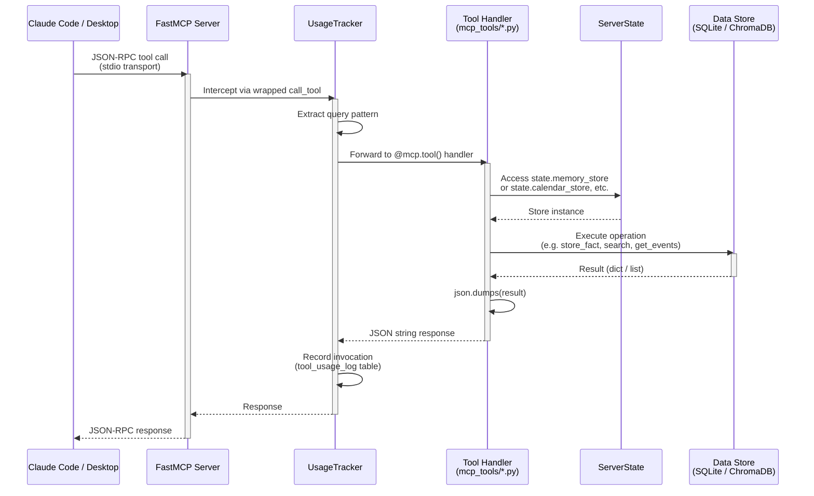

### Lifespan Initialization

Before any tool call is processed, the `app_lifespan` context manager initializes all stores and populates `ServerState`:

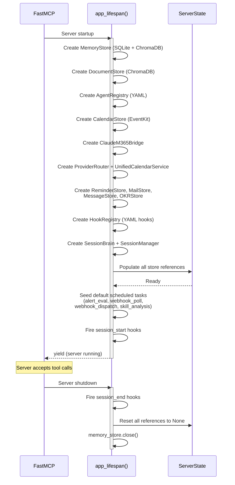

---

## 3. Data Model

### SQLite Schema (memory.db)

The MemoryStore manages 14 tables via a facade pattern that delegates to 7 domain stores sharing a single connection and lock.

```mermaid
erDiagram
    facts {
        int id PK
        text category "personal|preference|work|relationship|backlog"
        text key "UNIQUE with category"
        text value
        real confidence "0.0 to 1.0"
        text source
        int pinned "0 or 1"
        timestamp created_at
        timestamp updated_at
    }

    facts_fts {
        text key
        text value
        text category
    }

    locations {
        int id PK
        text name "UNIQUE"
        text address
        real latitude
        real longitude
        text notes
        timestamp created_at
    }

    context {
        int id PK
        text session_id
        text topic
        text summary
        text agent
        timestamp created_at
    }

    decisions {
        int id PK
        text title
        text description
        text context
        text status "pending_execution|executed|deferred|reversed"
        text follow_up_date
        text tags
        text owner
        timestamp created_at
    }

    delegations {
        int id PK
        text task
        text delegated_to
        text due_date
        text priority "low|medium|high|critical"
        text status "active|completed|cancelled"
        timestamp created_at
    }

    alert_rules {
        int id PK
        text name "UNIQUE"
        text alert_type
        text condition "JSON"
        int enabled "0 or 1"
        timestamp last_triggered_at
    }

    webhook_events {
        int id PK
        text source
        text event_type
        text payload "JSON"
        text status "pending|processed|failed"
        timestamp received_at
    }

    event_rules {
        int id PK
        text name "UNIQUE"
        text event_source
        text event_type_pattern
        text agent_name
        text agent_input_template
        text delivery_channel
        int priority
    }

    scheduled_tasks {
        int id PK
        text name "UNIQUE"
        text schedule_type "interval|cron|once"
        text schedule_config "JSON"
        text handler_type
        text handler_config "JSON"
        int enabled
        timestamp next_run_at
        timestamp last_run_at
        text delivery_channel
    }

    skill_usage {
        int id PK
        text tool_name
        text query_pattern "UNIQUE with tool_name"
        int count
        timestamp last_used
    }

    tool_usage_log {
        int id PK
        text tool_name
        text query_pattern
        int success
        int duration_ms
        text session_id
        timestamp created_at
    }

    skill_suggestions {
        int id PK
        text description
        text suggested_name
        real confidence
        text status "pending|accepted|rejected"
    }

    agent_memory {
        int id PK
        text agent_name
        text memory_type "insight|preference|context"
        text key "UNIQUE with agent_name+memory_type"
        text value
        real confidence
        text namespace
    }

    identities {
        int id PK
        text canonical_name
        text provider "UNIQUE with provider_id"
        text provider_id
        text display_name
        text email
    }
```

### MemoryStore Facade Pattern

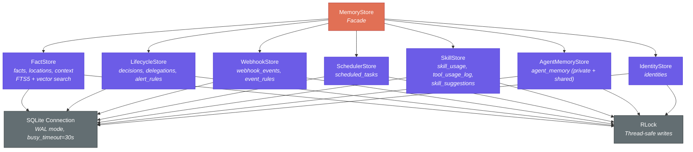

---

## 4. Agent Execution

### Tool-Use Loop

The `BaseExpertAgent` runs an autonomous tool-use loop with the Claude API. Each agent is gated by the capabilities declared in its YAML config.

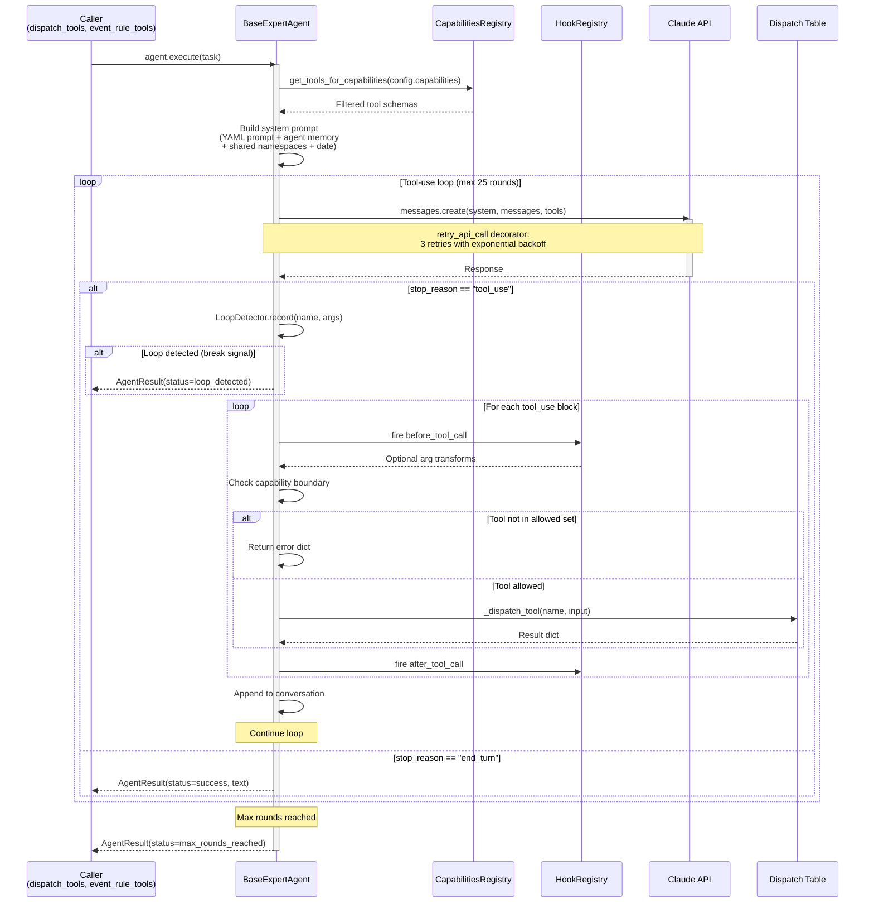

### Capability Gating

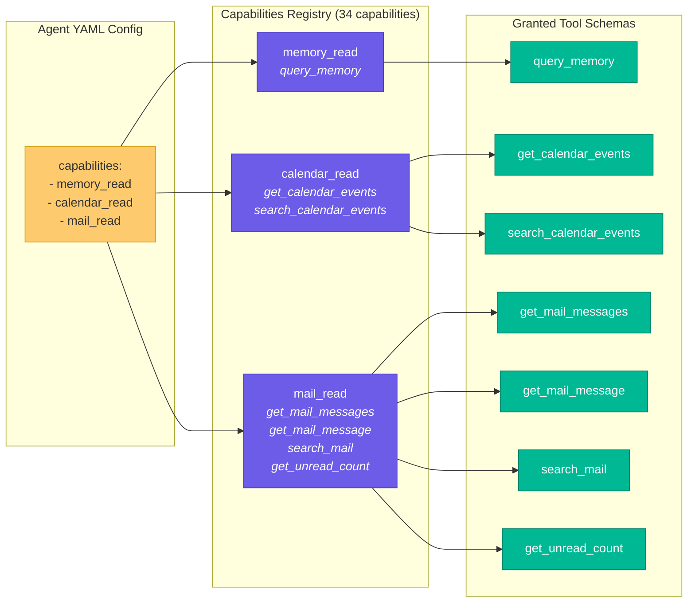

### Dynamic Complexity Triage

Before dispatching an agent, a lightweight Haiku pre-call classifies task complexity. Simple tasks get downgraded to the Haiku model tier for cost savings.

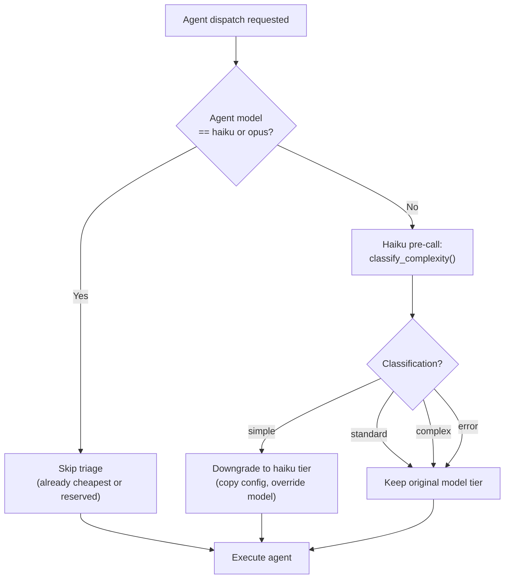

### Capabilities Reference

| Capability | Tools | Status |
|-----------|-------|--------|
| `memory_read` | query_memory | Implemented |
| `memory_write` | store_memory | Implemented |
| `document_search` | search_documents | Implemented |
| `calendar_read` | get_calendar_events, search_calendar_events | Implemented |
| `reminders_read` | list_reminders, search_reminders | Implemented |
| `reminders_write` | create_reminder, complete_reminder | Implemented |
| `notifications` | send_notification | Implemented |
| `mail_read` | get_mail_messages, get_mail_message, search_mail, get_unread_count | Implemented |
| `mail_write` | send_email, mark_mail_read, mark_mail_flagged, move_mail_message | Implemented |
| `teams_write` | open_teams_browser, post_teams_message, confirm_teams_post, cancel_teams_post, close_teams_browser | Implemented |
| `decision_read` | search_decisions, list_pending_decisions | Implemented |
| `decision_write` | create_decision, update_decision, delete_decision | Implemented |
| `delegation_read` | list_delegations, check_overdue_delegations | Implemented |
| `delegation_write` | create_delegation, update_delegation, delete_delegation | Implemented |
| `alerts_read` | check_alerts, list_alert_rules | Implemented |
| `alerts_write` | create_alert_rule, dismiss_alert | Implemented |
| `scheduling` | find_my_open_slots, find_group_availability | Implemented |
| `agent_memory_read` | get_agent_memory | Implemented |
| `agent_memory_write` | clear_agent_memory | Implemented |
| `channel_read` | list_inbound_events, get_event_summary | Implemented |
| `proactive_read` | get_proactive_suggestions, dismiss_suggestion | Implemented |
| `webhook_read` | list_webhook_events, get_webhook_event | Implemented |
| `webhook_write` | process_webhook_event | Implemented |
| `scheduler_read` | list_scheduled_tasks, get_scheduler_status | Implemented |
| `scheduler_write` | create_scheduled_task, update_scheduled_task, delete_scheduled_task, run_scheduled_task | Implemented |
| `skill_read` | list_skill_suggestions | Implemented |
| `skill_write` | record_tool_usage, analyze_skill_patterns, auto_create_skill | Implemented |
| `web_search` | -- | Legacy |
| `code_analysis` | -- | Legacy |
| `writing` | -- | Legacy |
| `editing` | -- | Legacy |
| `data_analysis` | -- | Legacy |
| `planning` | -- | Legacy |
| `file_operations` | -- | Legacy |
| `code_execution` | -- | Legacy |

---

## 5. Unified Calendar System

The unified calendar routes operations across Apple Calendar (EventKit) and Microsoft 365 (via Claude CLI bridge), with provider-specific routing, event deduplication, and ownership tracking.

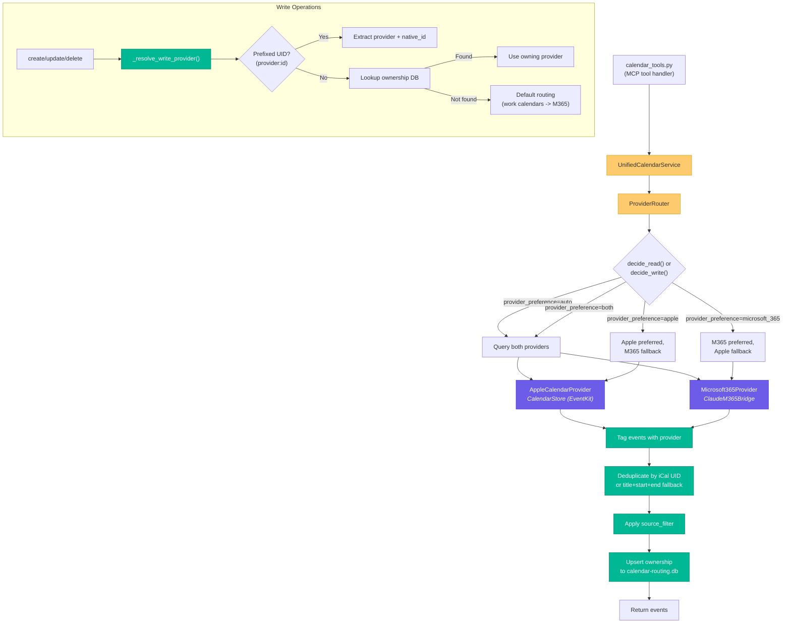

### Dual-Read Policy

When `CALENDAR_REQUIRE_DUAL_READ=true` (default), both providers must succeed for read operations. If either fails, a structured error is returned containing partial results and the specific provider that failed.

---

## 6. Scheduler and Daemon

### Scheduler Architecture

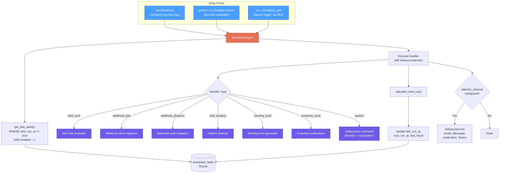

### Schedule Types

| Type | Config Format | Example |
|------|--------------|---------|
| `interval` | `{"minutes": N}` or `{"hours": N}` | Run every 30 minutes |
| `cron` | `{"expression": "*/15 * * * *"}` | Standard 5-field cron |
| `once` | `{"run_at": "2026-03-01T09:00:00"}` | Single future execution |

### Daemon Lifecycle

The `JarvisDaemon` replaces three separate launchd agents with a single persistent process:

| Old Agent | Poll Interval | Replacement |
|-----------|--------------|-------------|
| `com.chg.scheduler-engine.plist` | 5 min | Daemon tick loop |
| `com.chg.alert-evaluator.plist` | 2 hours | `alert_eval` handler |
| `com.chg.inbox-monitor.plist` | 5 min | `webhook_poll` handler |

---

## 7. Webhook and Event-Driven Dispatch

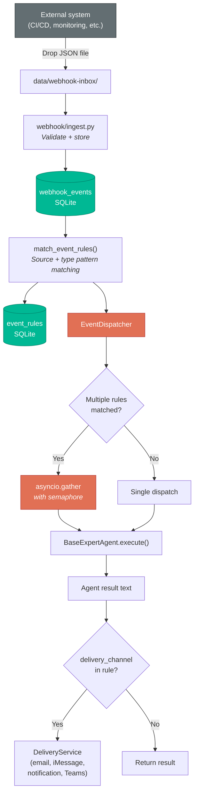

### Event Rule Schema

| Field | Purpose |
|-------|---------|
| `event_source` | Source to match (e.g. "github", "jira") |
| `event_type_pattern` | Glob pattern for event types (e.g. "alert.*") |
| `agent_name` | Expert agent to activate on match |
| `agent_input_template` | String.Template with `$event_type`, `$source`, `$payload`, `$timestamp` |
| `delivery_channel` | Result delivery: "email", "imessage", "notification", or "teams" |
| `priority` | Rule ordering (lower = higher priority) |

---

## 8. Session Management

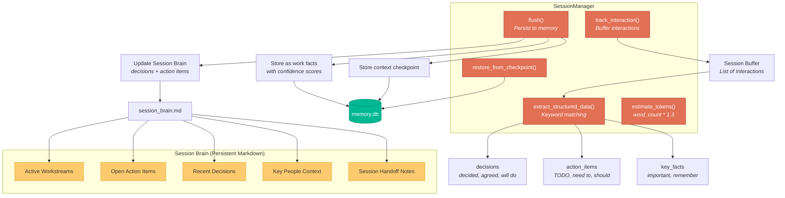

---

## 9. Channel Routing

Outbound message routing with safety tiers, determining how messages should be delivered based on recipient type, content sensitivity, first-contact status, urgency, and work hours.

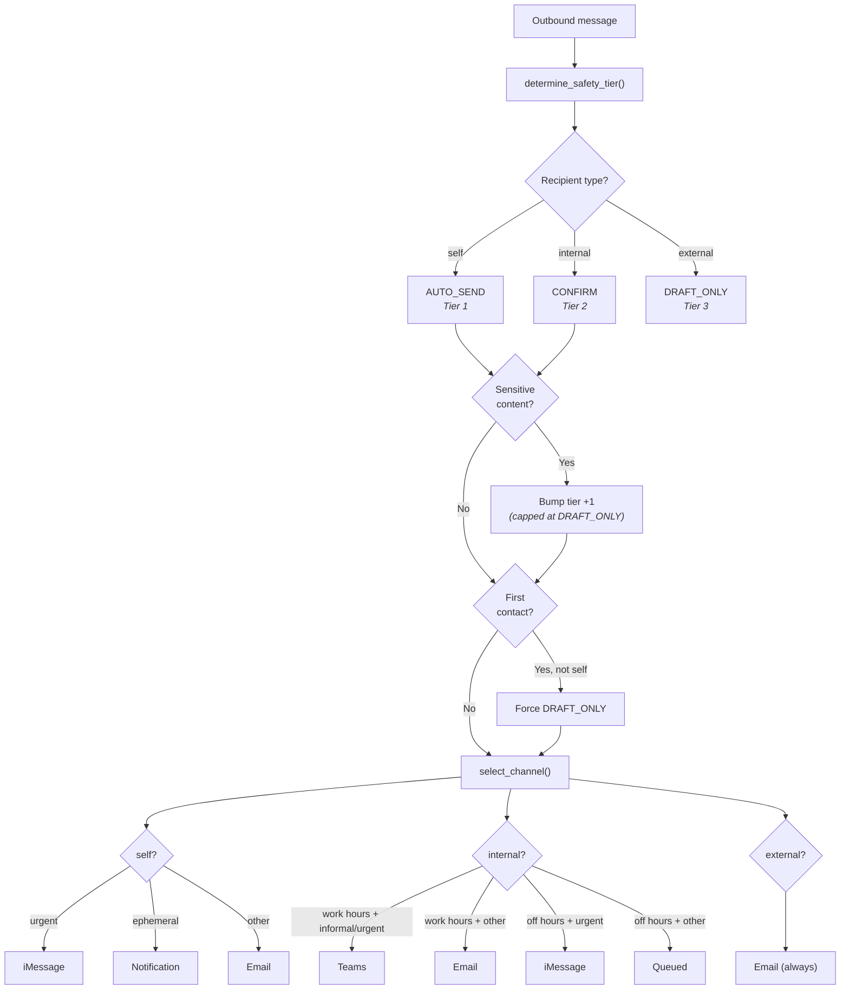

### Sensitive Topic Detection

Content is scanned for keywords matching HR, legal, financial, and confidential topics. Keywords include: salary, compensation, confidential, termination, PIP, harassment, merger, layoff, and others. Detection is case-insensitive and word-boundary aware.

---

## 10. Self-Authoring Skills

The system detects repeated tool usage patterns and suggests new agent configurations automatically.

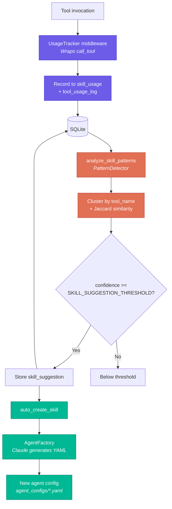

---

## 11. Proactive Suggestion Engine

Surfaces actionable insights by scanning existing data stores for items needing attention.

| Category | Trigger | Priority |
|----------|---------|----------|
| `delegation` | Active delegations past due date | High |
| `deadline` | Active delegations due within 3 days | High |
| `session` | Approaching context window limit (~120k tokens) | High |
| `decision` | Pending decisions older than 7 days | Medium |
| `skill` | Pending skill suggestions from pattern analysis | Medium |
| `checkpoint` | 50+ tool calls with no recent checkpoint | Medium |
| `session` | Unflushed decisions or action items | Medium |
| `session` | Open action items from previous sessions (via Brain) | Medium |
| `webhook` | Unprocessed webhook events | Low |
| `session` | Active workstreams (via Brain) | Low |

---

## 12. Identity Linking

Cross-channel identity resolution maps provider-specific accounts to canonical person names.

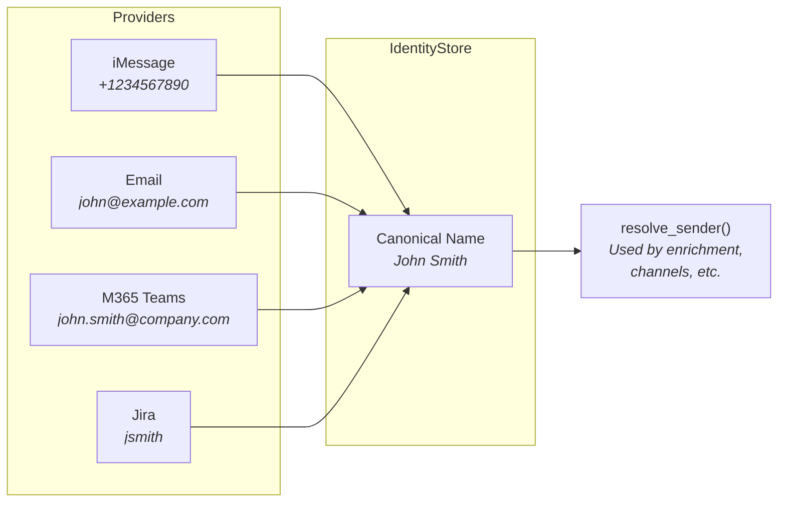

Supported providers: `imessage`, `email`, `m365_teams`, `m365_email`, `slack`, `jira`, `confluence`.

---

## 13. Plugin Hooks

YAML-configured lifecycle hooks that fire at key points without modifying core code.

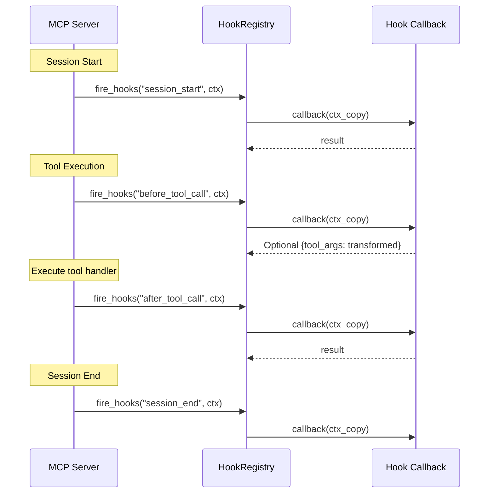

Hook YAML config format:
```yaml
- event_type: before_tool_call
  name: my_hook
  handler: hooks.builtin.audit_log_hook
  priority: 50
  enabled: true
```

---

## 14. Person Enrichment

Builds a consolidated profile by fetching from 6 data sources in parallel.

| Source | Data Retrieved | Store |
|--------|---------------|-------|
| Identities | Provider links (iMessage, email, Teams, etc.) | `memory_store.search_identity()` |
| Facts | Stored facts mentioning the person | `memory_store.search_facts()` |
| Delegations | Active delegations assigned to the person | `memory_store.list_delegations()` |
| Decisions | Decisions referencing the person | `memory_store.search_decisions()` |
| iMessages | Recent message threads with the person | `messages_store.search_messages()` |
| Emails | Recent email threads with the person | `mail_store.search_messages()` |

All fetches run concurrently via `asyncio.gather`. Failed sources are silently skipped. Results capped at 10 items per source.

---

## 15. Teams Browser Integration

Playwright-based automation for posting messages to Microsoft Teams through a persistent browser session.

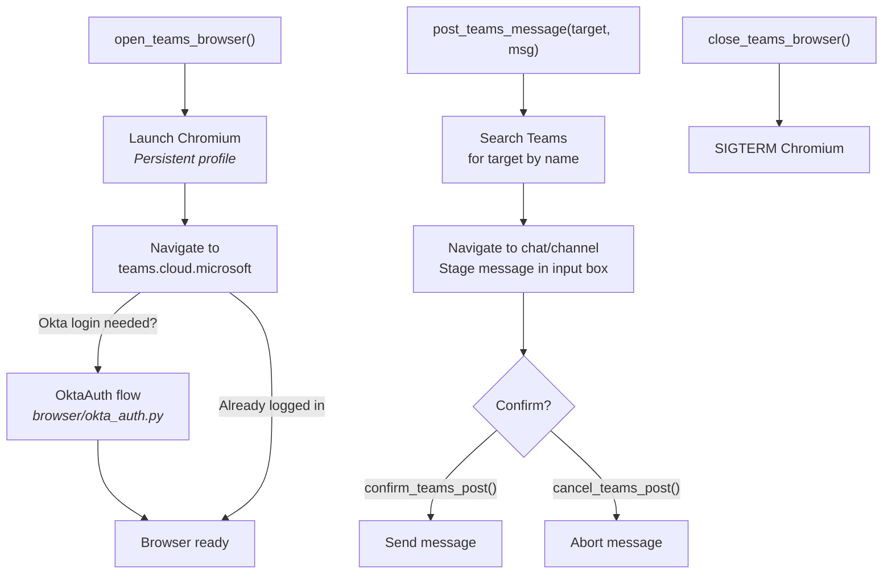

---

## 16. iMessage Inbox Monitor

The `inbox-monitor.sh` script polls iMessage for "jarvis:" commands using a three-pass Claude CLI pipeline.

| Pass | Purpose | Claude Model | Output |
|------|---------|-------------|--------|
| **Pass 1** | Classify message intent | Sonnet | `{category, agent, instruction}` |
| **Pass 2** | Execute via agent or inline | Sonnet | `{action_taken, success, provider_used}` |
| **Pass 3** | Deliver result to user | Sonnet | Email, iMessage reply, or notification |

---

## 17. Team Playbooks

YAML-defined parallel workstreams with input substitution and condition evaluation.

| Playbook | Purpose | Workstreams |
|----------|---------|-------------|
| `meeting_prep` | Pre-meeting research and agenda | Attendee research, topic prep, agenda drafting |
| `expert_research` | Multi-source research | Web, documents, memory, synthesis |
| `software_dev_team` | Parallel development | Architecture, implementation, testing, review |
| `daily_briefing` | Morning briefing | Calendar, email, messages, delegations, reminders |

---

## 18. Delivery System

Task and event results are delivered via configurable channel adapters. The delivery service is used by the scheduler, event dispatcher, and proactive engine.

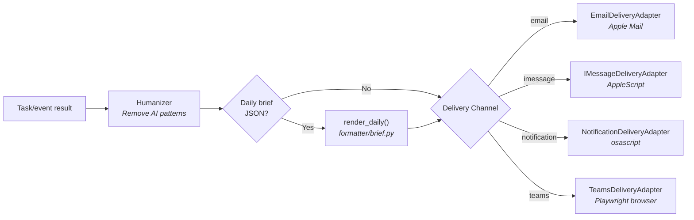

---

## 19. Humanizer

Rule-based text transformer that removes common AI writing patterns before delivery. Applied automatically by the delivery service.

Categories of rules:
- **Em dash removal** -- Replaces `--` and `---` with commas
- **AI vocabulary swaps** -- "utilize" to "use", "leverage" to "use", "comprehensive" to "full", etc.
- **Filler phrase removal** -- "In order to" to "To", "It is worth noting that" removed entirely
- **Sycophantic pattern removal** -- "Great question!", "I hope this helps!", etc.
- **Copula avoidance** -- "serves as" to "is", "functions as" to "is"
- **Hedging reduction** -- "could potentially" to "could"
